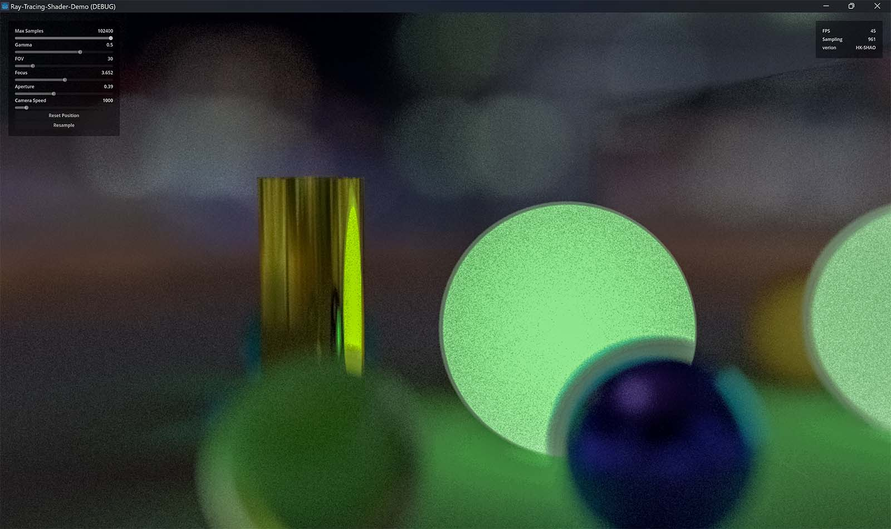
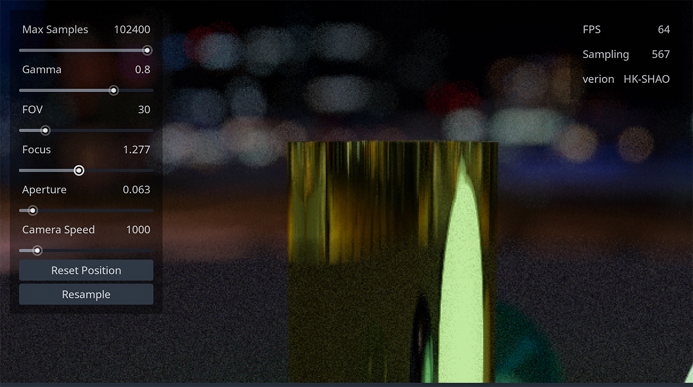
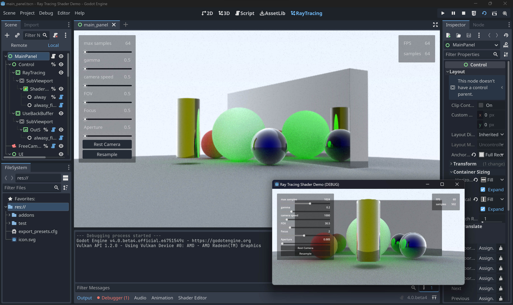
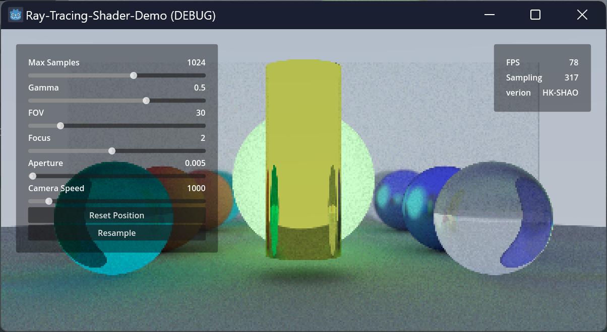
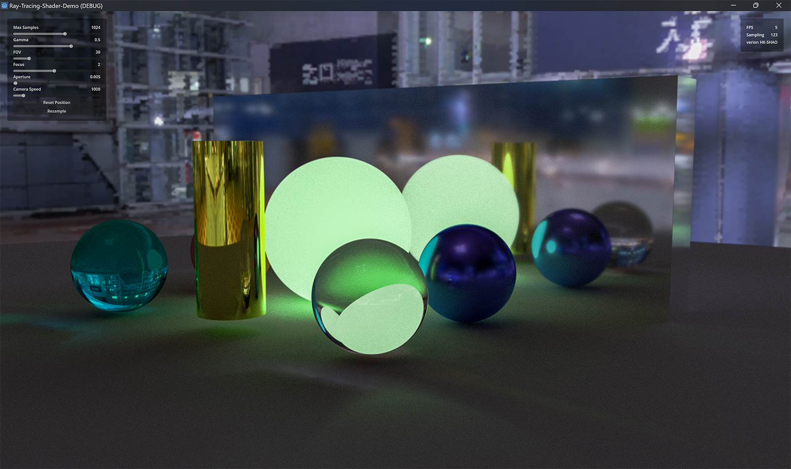

# Godot-RayTracing-Demo

<table>
    <tr>
        <td ></td>
        <td ></td>
    </tr>
</table>

A shader-based PBR ray tracing demo. Real-time denoise and you can freely adjust the camera's transforms, lens aperture, fov and focal length.

<table>
    <tr>
        <td ></td>
        <td ></td>
    </tr>
</table>

- Latest GitHub Gist
  - https://gist.github.com/HK-SHAO/2dbb8c717fb3fb137c5cd97a456d659d

## Demo

- [raytracing.shao.fun](https://raytracing.shao.fun)
- https://shaofun.itch.io/godot-raytracing  

- Hope you can contribute to this repo : )
  - https://github.com/HK-SHAO/Godot-RayTracing-Demo/

## more info

- GitHub: https://github.com/RayTracing
- Book: [Ray Tracing in One Weekend](https://raytracing.github.io/books/RayTracingInOneWeekend.html)
- ShaderToy: https://www.shadertoy.com/
- shao.fun https://shao.fun/blog/w/godot-ray-tracing.html
