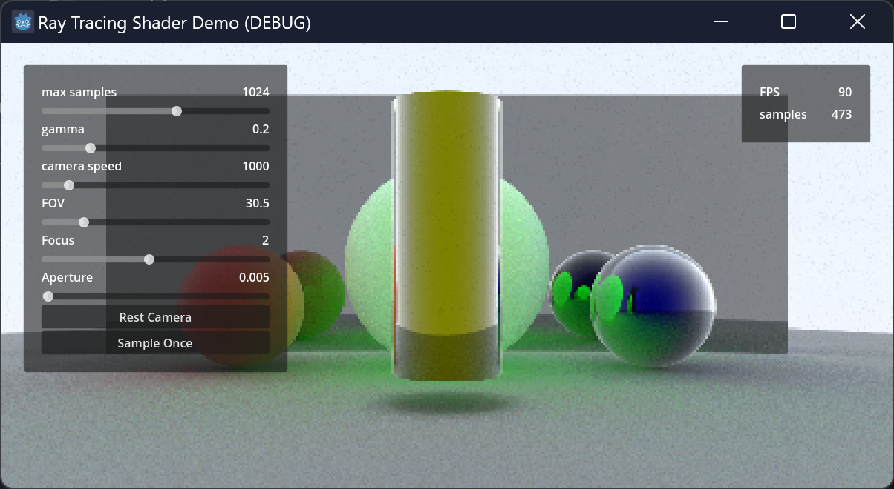
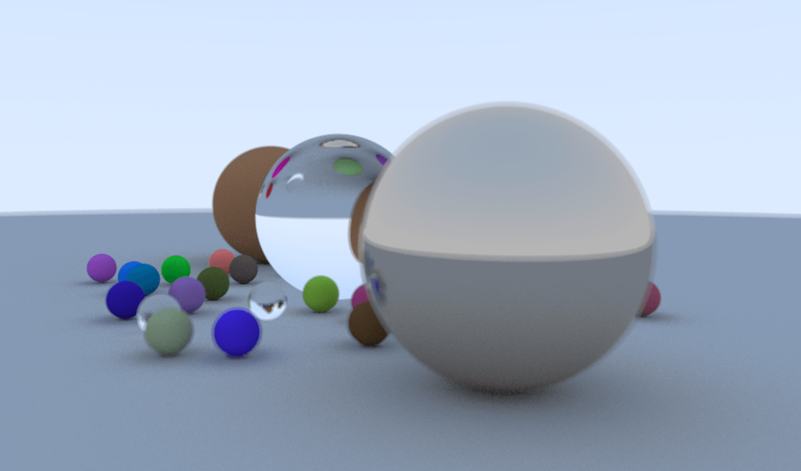

# Godot-RayTracing-Demo

A shader-based ray tracing demo

You can freely adjust the camera's transforms, lens aperture, fov and focal length

## more info

- GitHub: https://github.com/RayTracing
- Book: [Ray Tracing in One Weekend](https://raytracing.github.io/books/RayTracingInOneWeekend.html)
- ShaderToy: https://www.shadertoy.com/view/XlycWh
- shao.fun https://shao.fun/blog/w/godot-ray-tracing.html